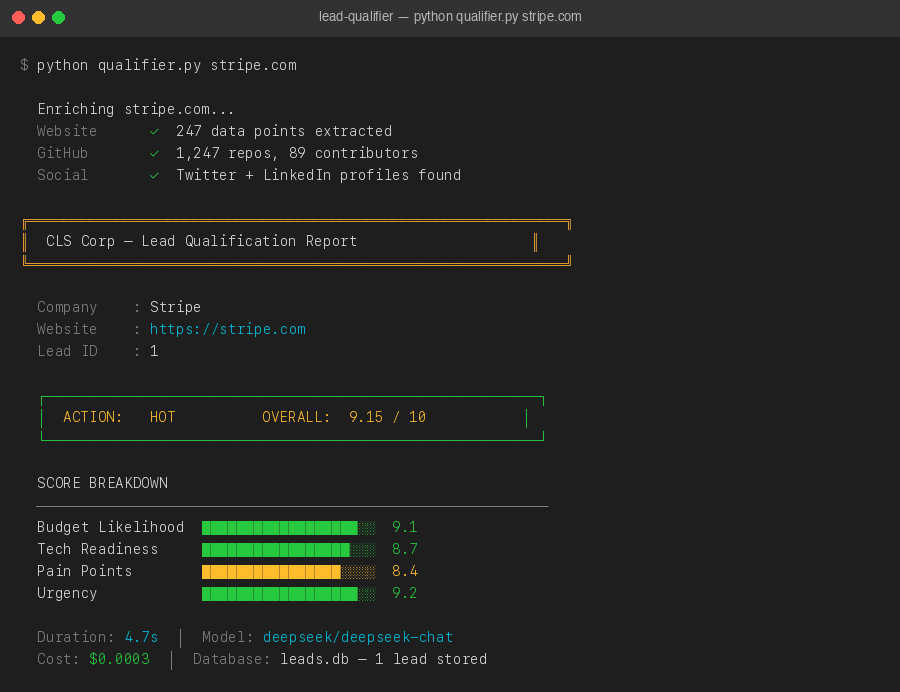

<p align="center">
  
</p>

<h1 align="center">AI Lead Qualification Agent</h1>

<p align="center">
  <strong>Enterprise-grade AI agent for B2B lead qualification, enrichment, and personalised outreach generation.</strong><br>
  Built by <a href="https://github.com/samueljai120">CLS Corp</a> — AI & Automation Agency
</p>

---



---

## Overview

The Lead Qualification Agent is a production-ready Python system that takes a
company name or website URL, scrapes publicly available data, and uses an LLM
(DeepSeek via OpenRouter) to produce a structured qualification report — all in
under 30 seconds.

```
stripe.com  ─►  Enrich  ─►  AI Score  ─►  Outreach Draft
                 │                │
            [website,         [budget:9.1
             linkedin,         tech:8.7
             github,           pain:8.4
             social]           urgency:9.2]
                                 │
                            ACTION: 🔥 HOT
```

---

## Features

| Capability | Details |
|---|---|
| **Multi-source enrichment** | Website scraping, GitHub API, LinkedIn (stub/Proxycurl) |
| **AI scoring** | 4-dimension 1-10 scoring via DeepSeek/OpenRouter |
| **Personalised outreach** | 4 tone variants × up to 4 email drafts |
| **SQLite persistence** | Full audit trail — leads, scores, outreach history |
| **Async pipeline** | All I/O concurrent via `asyncio.gather` |
| **CLI interface** | Argparse with `--output json` for pipeline integration |
| **Type-safe** | Full type hints, dataclasses throughout |
| **Production logging** | Structured timestamps, levels, and durations |

---

## Architecture

```
lead-qualifier/
├── qualifier.py     # Main pipeline: enrich → score → report
├── enricher.py      # Async multi-source data enrichment
├── outreach.py      # AI-powered cold email generator
├── database.py      # SQLite ORM — leads, scores, outreach history
├── leads.db         # Auto-created SQLite database (gitignored)
├── .env             # API keys (see .env.example)
├── requirements.txt
└── README.md
```

### Data Flow

```
                    ┌─────────────┐
  identifier  ──►  │  qualifier  │
(URL or name)      └──────┬──────┘
                          │
              ┌───────────▼───────────┐
              │     enricher.py       │
              │  ┌─────┐ ┌─────────┐  │
              │  │ Web │ │LinkedIn │  │  ← concurrent
              │  └─────┘ └─────────┘  │
              │  ┌────────────────┐   │
              │  │ Social/GitHub  │   │
              │  └────────────────┘   │
              └───────────┬───────────┘
                          │ EnrichmentResult
              ┌───────────▼───────────┐
              │   OpenRouter LLM      │
              │   (DeepSeek-Chat)     │
              └───────────┬───────────┘
                          │ LeadScore
              ┌───────────▼───────────┐
              │    database.py        │  ← SQLite WAL mode
              │  leads / scores /     │
              │  enrichment / outreach│
              └───────────────────────┘
```

---

## Quick Start

### 1. Install dependencies

```bash
python -m venv .venv
source .venv/bin/activate   # Windows: .venv\Scripts\activate
pip install -r requirements.txt
```

### 2. Configure environment

```bash
cp .env.example .env
# Edit .env and add your OPENROUTER_API_KEY
```

Get a free OpenRouter key at [openrouter.ai/keys](https://openrouter.ai/keys).
The default model is `deepseek/deepseek-chat` — cost-effective and fast.

### 3. Qualify a lead

```bash
# Basic qualification report
python qualifier.py stripe.com

# JSON output (for pipeline integration)
python qualifier.py stripe.com --output json

# Force re-enrichment + use a different model
python qualifier.py "Acme Corp" --force --model anthropic/claude-3-5-sonnet
```

### 4. Generate outreach emails

```bash
# Professional tone (default)
python outreach.py stripe.com

# Executive tone, 3 variants
python outreach.py stripe.com --tone executive --variants 3

# Technical peer-to-peer tone, JSON output
python outreach.py stripe.com --tone technical --output json
```

### 5. Enrich only (no scoring)

```bash
python enricher.py stripe.com
python enricher.py "Linear" --json
```

---

## Sample Output

```
╔══════════════════════════════════════════════════════════════╗
║  CLS Corp — Lead Qualification Report                        ║
╚══════════════════════════════════════════════════════════════╝

  Company    : Stripe
  Website    : https://www.stripe.com
  Lead ID    : 1
  Model      : deepseek/deepseek-chat

  ┌─────────────────────────────────────────────────────────┐
  │  ACTION: 🔥 HOT          OVERALL:  8.7 / 10            │
  └─────────────────────────────────────────────────────────┘

  SCORE BREAKDOWN
  ───────────────────────────────────────────────────────────
  Budget Likelihood  ██████████████████░░  9.1
  Tech Readiness     █████████████████░░░  8.7
  Pain Points        ████████████████░░░░  8.3
  Urgency            ██████████████████░░  9.2

  EXECUTIVE SUMMARY
  ───────────────────────────────────────────────────────────
  Stripe presents a tier-1 enterprise opportunity with clear
  AI/ML budget lines and a mature engineering organisation ...
```

---

## CLI Reference

### `qualifier.py`

| Flag | Default | Description |
|---|---|---|
| `identifier` | — | Company name or URL (required) |
| `--model` | `deepseek/deepseek-chat` | OpenRouter model ID |
| `--output` | `report` | `report` or `json` |
| `--force` | `False` | Re-enrich even if cached |
| `--verbose` / `-v` | `False` | Enable DEBUG logging |

### `outreach.py`

| Flag | Default | Description |
|---|---|---|
| `identifier` | — | Company name or URL (required) |
| `--tone` | `professional` | `professional`, `casual`, `executive`, `technical` |
| `--variants` | `1` | Number of drafts to generate (1–4) |
| `--model` | `deepseek/deepseek-chat` | OpenRouter model ID |
| `--output` | `pretty` | `pretty` or `json` |

### `enricher.py`

| Flag | Default | Description |
|---|---|---|
| `identifier` | — | Company name or URL (required) |
| `--force` | `False` | Re-enrich even if cached |
| `--json` | `False` | Output raw JSON |

---

## Database Schema

```sql
leads       — canonical company records
enrichment  — per-source enrichment JSON blobs (upserted)
scores      — versioned 4-dimension scores with rationale
outreach    — email drafts with status tracking (draft/sent/replied)
```

All tables use `WAL` journal mode for concurrent read performance.

---

## Extending the Agent

### Add a real LinkedIn integration

Replace the stub in `enricher.py::enrich_linkedin()` with a
[Proxycurl](https://nubela.co/proxycurl) call:

```python
resp = await client.get(
    "https://nubela.co/proxycurl/api/linkedin/company",
    params={"url": f"https://linkedin.com/company/{slug}"},
    headers={"Authorization": f"Bearer {os.getenv('PROXYCURL_API_KEY')}"},
)
```

### Switch AI model

Pass any [OpenRouter-supported model](https://openrouter.ai/models):

```bash
python qualifier.py stripe.com --model anthropic/claude-3-5-sonnet
```

### Integrate into a workflow

```python
from qualifier import qualify_lead
from outreach import generate_outreach

report = await qualify_lead("stripe.com")
if report.score.recommended_action == "HOT":
    drafts = await generate_outreach("stripe.com", tone="executive", variants=2)
    # Push drafts to your CRM / email queue
```

---

## Tech Stack

- **Python 3.11+** — async/await, type hints, dataclasses
- **httpx** — async HTTP with HTTP/2 and connection pooling
- **BeautifulSoup4 + lxml** — fast HTML parsing
- **OpenRouter** — unified LLM gateway (DeepSeek, Claude, GPT-4o, etc.)
- **SQLite** — zero-dependency persistence with WAL mode
- **python-dotenv** — 12-factor app config

---

## About CLS Corp

**CLS Corp** builds enterprise AI automation systems — from lead qualification
pipelines to full agentic workflows. We specialise in LLM integration,
intelligent process automation, and production-grade AI infrastructure.

[clscorp.ai](https://clscorp.ai) · [contact@clscorp.ai](mailto:contact@clscorp.ai)

---

*This repository is a portfolio demonstration of CLS Corp's engineering
capabilities. All scraping is performed on publicly accessible data only.*
